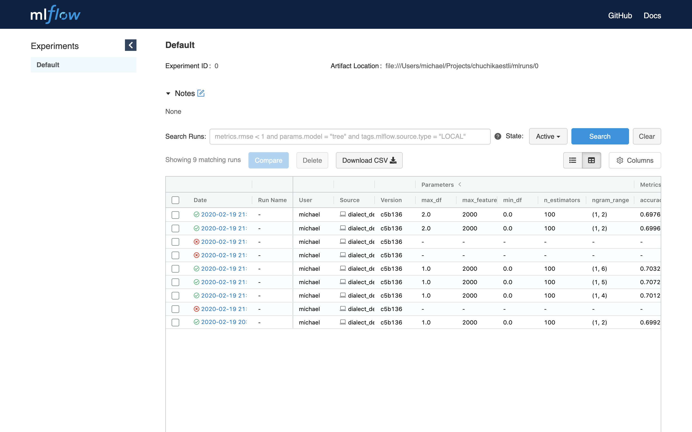

# chuchikaestli

chuchikaestli is a [Swiss German dialect](https://en.wikipedia.org/wiki/Swiss_German) predictor using TF-IDF vector 
representations and a Random Forest classifier. 

The whole ML-lifecycle is supported by [mlFlow](https://mlflow.org/). That is, the model is first trained using 
different hyper parameters. As a result, both optimal parameter settings as well as the trained model are logged by 
mlFlow. Eventually, the logged model can be made available as REST-interface to predict arbitrary Swiss German 
sentences.

The evaluation is based on a publicly available Swiss German 
[kaggle competition](https://www.kaggle.com/c/swiss-dialect-identification/overview). This dataset is based on four
different dialects:

```
BE Bernese
LU Lucerne
ZH Zurich
BS Basel
```

Whereby the training set consists of 15573 example sentences, wheres as the test set consists of 2499 example sentences.

## Requirements

First, install `pipenv` using `pip`:

```bash
pip install --user pipenv
```

## Installation

To load all dependencies into an own virtual environment:

```bash
cd <your_project_path>/chuchikaestli
pipenv install
```

Next, you can import the created virtual environment into your preferred IDE and activate it in your shell:

```bash
pipenv shell
```

## Usage

### Start mlFlow UI

To start the mlFlow UI (virtual environment needs to be activated before):

```bash
mlflow ui
```

Next, you can open the mlFlow UI at [http://localhost:5000/](http://localhost:5000/) using your preferred browser.

### Train model

You can train the model either by `train_dialect` (fixed parameter setting) or `train_dialect_hyperparameter` (grid 
search over different parameter settings). In both cases, the best parameters as well as the model itself is logged 
in the [mlFlow UI](http://localhost:5000/).



### Predict by REST-interface

To serve the model as REST interface we first have to get the run ID, see [mlFlow UI](http://localhost:5000/).


Next, you can serve the model:
```bash
mlflow models serve -m mlruns/0/<run-ID>/artifacts/model/ -p 1234
```

Example for run ID `b90dd8133a4343668f2416b1e2fddba2`:

```bash
mlflow models serve -m mlruns/0/b90dd8133a4343668f2416b1e2fddba2/artifacts/model/ -p 1234
```

Finally, you can use the REST interface to predict arbitrary Swiss German sentences by `predict_dialect`.